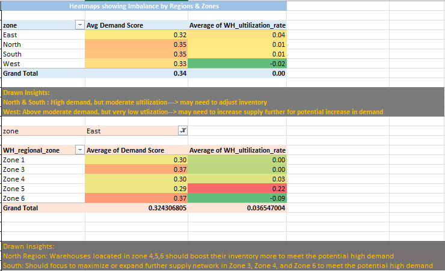
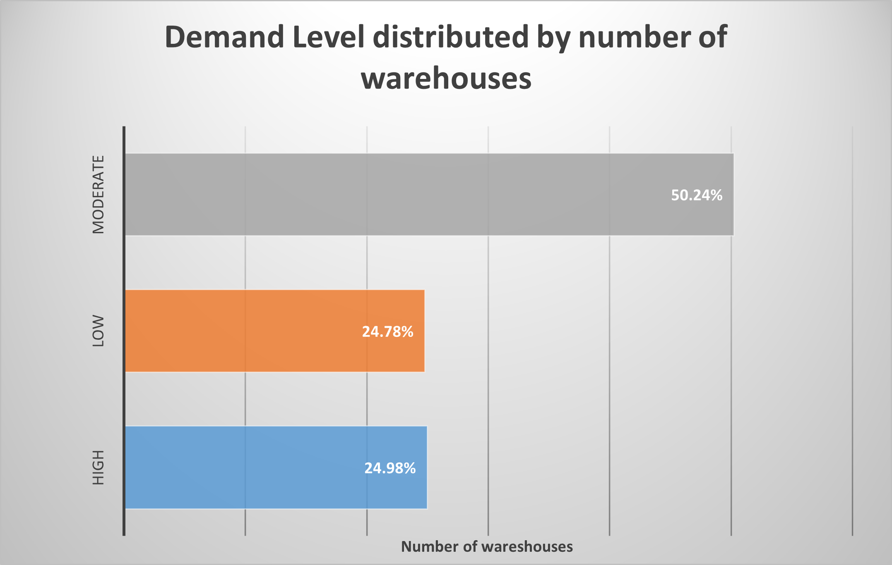
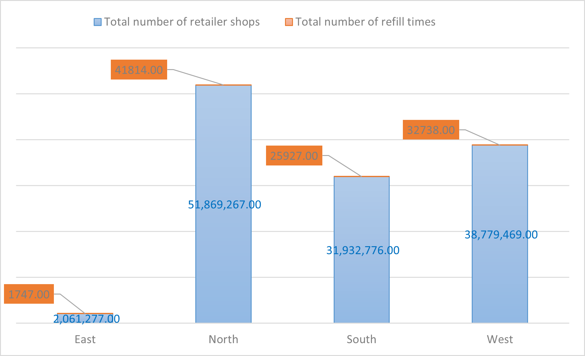
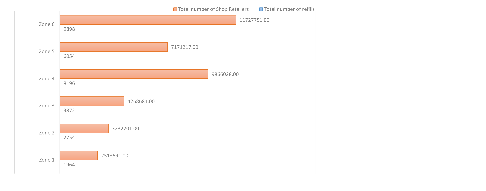
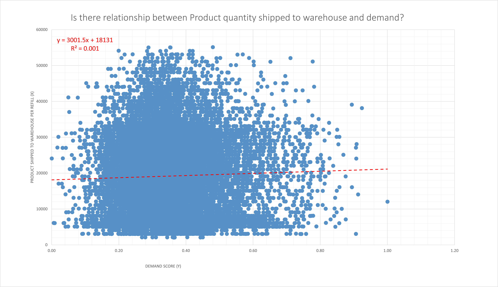
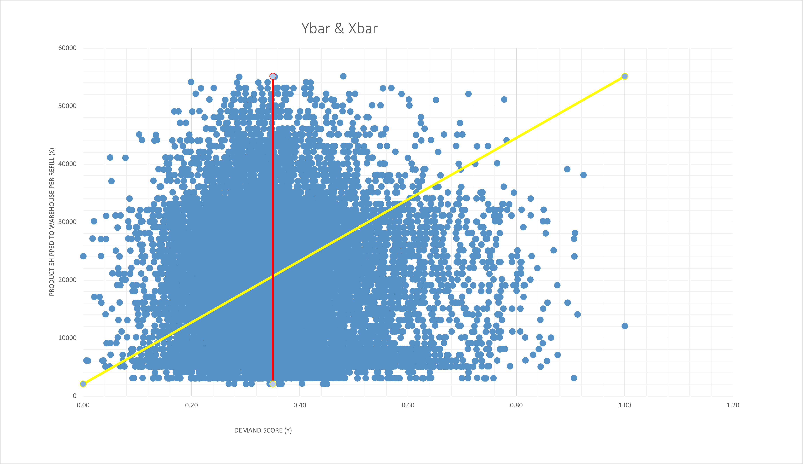
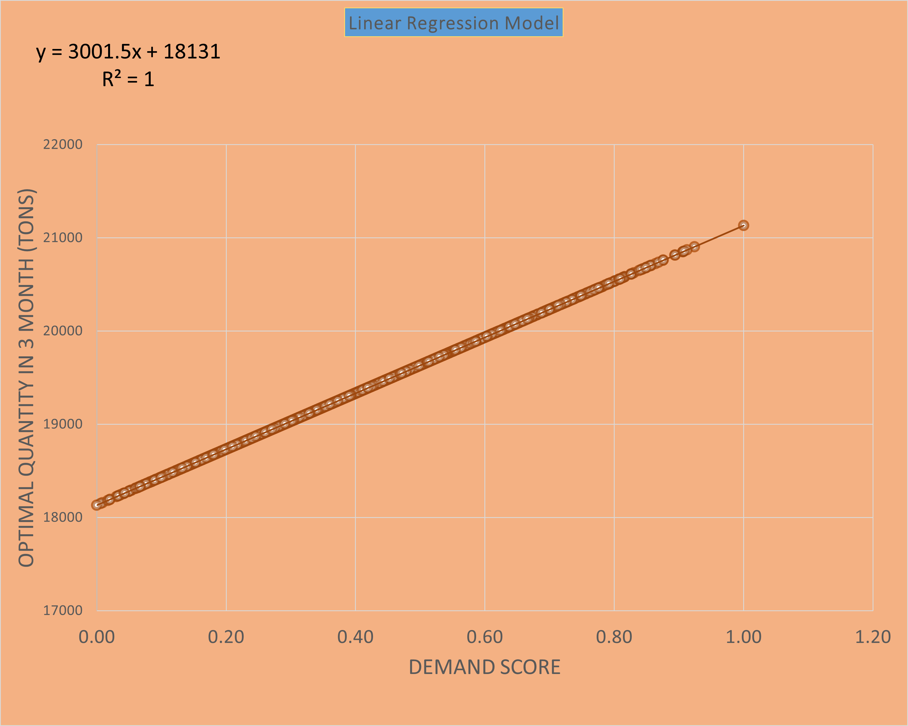

# FMCG Instant Noodles Supply Chain Optimization

This repository provides an analysis of the supply chain for an FMCG instant noodles business. Below are key findings and visualizations to give a quick overview.

## Key Visualizations

### Demand Heatmap
This heatmap highlights regions with high and low demand levels across different zones.

### Demand Level Distributed by Number of Warehouses

### Total Number of Retailer Shops and Refill Times by Region

### Total Number of Shop Retailers and Refills by Zone

### Supply-Demand Alignment Chart
This scatter plot shows the alignment between supply capacity and demand score for each warehouse.

 ## RegressionModel
 This scatter plot shows how the regression model looks like after the optimal quantity of products is identified
 
